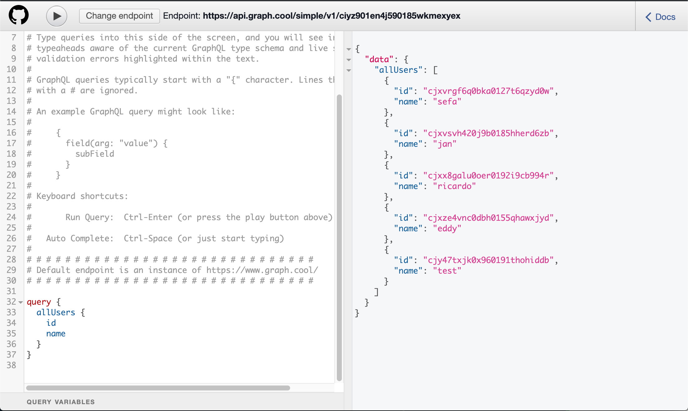
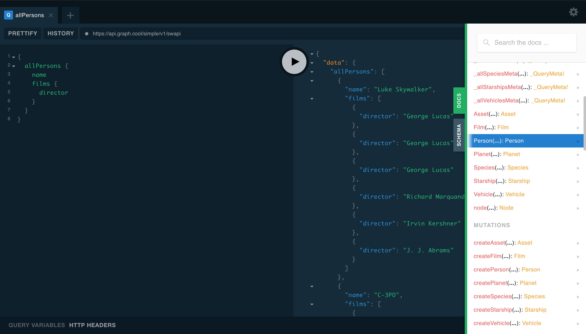
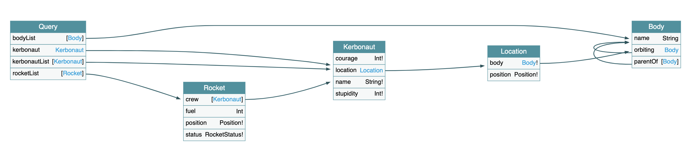

### Two years into GraphQL

My team recently had to work on the technical design for a whole new part in our main web app. We had to understand the requirements, challenge them and finally transpose them into designs for our database, UI structure and more importantly the API used between the front-end and the back-end. As GraphQL users for about two years now, we developed a mindset where our GraphQL schema is at the center of our technical design.

Two points of interest stand out of our exercise. The first one is about how powerful are the tools that we used to design our GraphQL schema. The second one is how defining our API schema helped us to understand and challenge the original requirements and communicate better between people.

This first blog post will focus on the tools themselves, while the next one will detail how we used them and what kind of transformation GraphQL can bring to an organization.

### Foreword on GraphQL

Few words on GraphQL first. From the [GraphQL official website](https://graphql.org/):

> GraphQL is a query language for APIs and a runtime for fulfilling those queries with your existing data. GraphQL provides a complete and understandable description of the data in your API, gives clients the power to ask for exactly what they need and nothing more, makes it easier to evolve APIs over time, and enables powerful developer tools.

Another way to put it means that GraphQL is an alternative for REST, SOAP and friends. Its vision is being consumer-driven and agnostic of back-end implementations and technologies. 

GraphQL is being developed and used by Facebook since 2012 and was open-sourced in 2015 via a specification and a reference implementation. Since then a lot of new servers and clients saw birth using the same specification (and are therefore compatible). The genesis of GraphQL is interesting and the move toward open-sourcing is a success story to analyze. A great [documentary](https://www.youtube.com/watch?v=783ccP__No8) is available if you're interested.

Our global experience with GraphQL has been fantastic. The technology is still young. We encountered pitfalls and struggled to identify best practices and antipatterns but the learnings from our failures in the GraphQL world resulted in more excitement about the tech.

### The power of introspection

One of the most interesting features of GraphQL is the natural ability for a server to describe its schema via [introspection](https://graphql.org/learn/introspection/). This requires no additional work on the back-end and is already present in all server implementations. What it means in practice is that it's possible to send GraphQL queries to a server to get up to date API documentation, usually in JSON.

As a result, most tools built around GraphQL are quite adaptive. They can be configured by feeding them the result of an introspection query or they can trigger the query themselves! Some of these tools are shipped with popular GraphQL server implementations like [Apollo Server](https://www.apollographql.com/docs/apollo-server/). Its default configuration exposes GraphQL Playground, a web IDE.

### GraphQL Web IDE

When working with a web API, one of the first thing that a developer usually do is to play with the API using tools like curl, wget. Setup headers then hit the correct URL and see the results (or errors). The experience is greatly enhanced by using a tool like [Postman](https://www.getpostman.com). It's quite easy to fire GraphQL queries using Postman even if you will probably make a lot of typos and need API documentation.

Using the powers of introspection, tools like [GraphiQL](https://github.com/graphql/graphiql) will send you to another dimension. On launch or endpoint selection, the tool will automatically introspect the API for you and give you superpowers.
You can write queries with autocompletion and validation error while keeping an eye on the documentation! That's the tool exposed by the [GitHub GraphQL API](https://developer.github.com/v4/explorer/). I'm pretty sure one can write basic queries without any prior knowledge about the API or the query language. There are of course online implementations that will work with any GraphQL server as long as you don't need auth for it (https://lucasconstantino.github.io/graphiql-online/).



In our team, we are using a very similar tool: [GraphQL Playground](https://github.com/prisma/graphql-playground). It supports custom HTTP headers, tabs and saves queries. Here's one bin to play with [https://www.graphqlbin.com/v2/6RQ6TM](https://www.graphqlbin.com/v2/6RQ6TM). I don't think that we can live without it nowadays.



Take note that there can be descriptions for each type and field. [GraphQL spec](https://graphql.github.io/graphql-spec/June2018/#sec-Documentation) supports markdown for those descriptions.

One can use an online version of these tools or build your internal web apps. In my team, we are using Playgrounds' express middleware configured on our specific GraphQL endpoint. I only wish the middleware would allow us to configure default headers to avoid having to set up auth each time we load it.

These tools are also incredibly useful when doing one-shot programming ([see previous blog post](https://codingwithjs.rocks/blog/the-only-time-i-use-var)). Build your custom query in the IDE, fire it and copy-paste the result. Not only it was easy to write, but in the GraphQL world, the queries are shaping the answer, resulting in super easy to swallow payloads.

### GraphQL Voyager for stellar API cartography

The docs exposed by GraphQL IDEs are great but exploring a schema by navigating through the edges has its limits if you want to have a global picture of the API.

As the totality of the schema can be introspected using the correct query, it would be cool to have a global representation of the API. What about a nice diagram? Of course, there's a tool for it.

[GraphQL Voyager](https://apis.guru/graphql-voyager/) automatically builds diagrams for your API. With the online tool, you can explore some public GraphQL APIs like Github or Yelp. It's also possible to use introspection (copy-paste the query from the web interface, run the query in Playground and paste the result) or funnier, directly use the Schema Definition Language (SDL).

SDL is a human-readable format describing a GraphQL Schema and therefore, API. It's possible to generate SDL through tools ([Graphene](https://github.com/graphql-python/graphene), [Nexus](https://github.com/prisma/nexus) and many others) to simply write it directly by hand. Choosing between SDL or Code first is [heavily debated in the commmunity](https://twitter.com/jorditeddy/status/1141991622747598848) but in the end, both options are fine. My team is using an SDL first approach.

Let's try using this Kerbal Space Program example schema in SDL. (KSP is a popular video game featuring little green men called Kerbals trying to fly custom made rockets into space and usually ending in huge fireballs).

```graphql
  type Query {
    bodyList: [Body]
    kerbonaut(id: ID): Kerbonaut
    kerbonautList: [Kerbonaut]
    rocketList: [Rocket]
  }

  type Kerbonaut {
    courage: Int!
    location: Location
    name: String!
    stupidity: Int!
  }

  type Body {
    name: String
    orbiting: Body
    parentOf: [Body]
  }

  type Location {
    body: Body!
    position: Position!
  }

  type Rocket {
    crew: [Kerbonaut]
    fuel: Int
    position: Position!
    status: RocketStatus!
  }

  enum Position {
    CRASHED
    ORBITING
    STATIC
  }

  enum RocketStatus {
    OPERATIONAL
    RAPID_UNPLANNED_DISASSEMBLED
    SHOULD_HAVE_BIGGER_ANTENNA
  }
```

As you can see, the GraphQL schema expressed in SDL is easy to read. Each type has fields and each field is typed. Brackets are used to express a collection of the given type. The relations between the different entities are clear, even if you have little programming experience. 

And this is what Voyager will give you if you provide this SDL version of the API:



You can click on any type or any edge to have more information about them and highlight the paths and links in your schema.
Honestly, the first time I saw this running with the real schema of my project, my jaw dropped.

As usual with GraphQL tools, Voyager exists as a standalone web app or as middleware for your favorite webserver. Contrary to Playground, it's possible to add default headers for auth.

### More tools and beyond

The GraphQL community is very active and we see births of new tools every week. GraphQL implementations often propose some powerful features that can help actual implementations (react hook support, caching, app state management, federation, batch loading, etc.) but also exploration and prototypal ones. I find mocking particularly useful as it enables our front-end to work with partially or completely mocked back-end while the back-end features are being developed.

And it's the part that I like the most with GraphQL. The simplicity of the language plus the tooling goes beyond the technical aspect of the API. This is changing the way people are interacting together. Front-end guys to back-end guys, developers with product owners, technical people with business people, business people with customers.

Some elements of this blog post might hint you at the way we used GraphQL tooling to design the new section of our main app and how GraphQL can have an impact outside the dev team. I'll go into more details soon.

Stay tuned for the next post.
