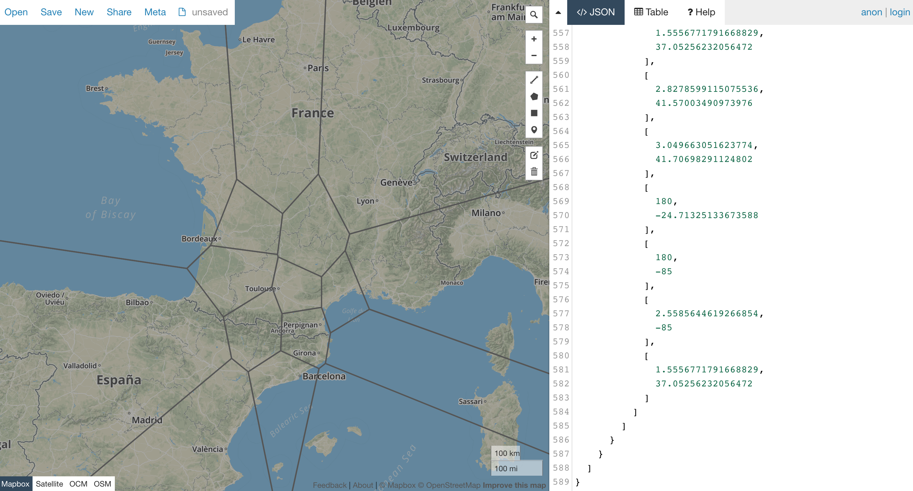

### Var is obsolete

First thing first. Of the three ways to declare a variable in JavaScript, `var` has no place in your codebase, and most of the time that you are tempted to use `let`, there's a better way to write it with `const`. There are several articles on this and it's a classic interview question. If you are in a situation where you need to target a very old version of JavaScript and you don't have access to a transpiler like Babel, I feel sorry for you.

So if we cannot use `var` in the codebase, why are we talking about it? Well, the answer is that we are taking a walk outside the codebase.

### One-shot programming

Programming is about automation and data manipulation. The french word for computer science is 'Informatique', the contraction of 'Information' and 'Automatique'. Facing a problem requiring repetition of a lot of steps, programmers try to find ways to automate parts or the totality of the resolution of the problem. They usually do it not only for the initial set of inputs but for all or most of them so that we only have to solve the problem once. So software engineers will not create something that knows how to multiply 46545 by 433435. They will build an engine that given two numbers, returns the product of those numbers. Cool!

But building a generic solution or a reusable engine requires more work than just find the solution to our initial problem. We need to handle edge cases, ensure long term maintenance and have a 'production' environment. Writing the code for it is also more difficult as we have to write stuff before running some data into it to see how it looks. Most of this is wasted effort if you need to do the actual computation only once.

Let's consider a classic use case when you have to prepare data before a meeting. You have to extract data from a source (like a DB), clean it, find patterns and build some stats.  If it takes hours to do and you need to do the same thing again every day, automation is a clear winner, but very often it does not. XKCD has a great table to help if something is worth automating:


Does that mean that you have to suffer and parse those 10.000 strings by hand? Of course not! Sometimes I just have 10 minutes before an impromptu meeting. Let's do one-shot programming. If only we had a great environment where we can make one shot automation of those pesky repetitive tasks... It turns out that most browsers implement a really good programming environment!

### The browser is my favorite IDE

You have at your disposal a JavaScript REPL (Read Eval Print Loop), the ability to save snippets of code, debuggers, multiple terminals and if you're lucky internet provides you an incredible ecosystem. The average salesman laptop already contains everything that you need.

So let's open the console and start by the first step: putting our input data into a variable and then let's hack things

```javascript
> const data = [1,2,3,4,5,6,7];
< undefined
> const filteredData = data.filter(num => num > 5);
< undefined
// BTW what is my filteredData?
> filteredData
<( 2) [6, 7]
> filteredData.map(num => num * 42)
< (2) [252, 294]
```

The funny thing with a browser like Chrome is that you don't even have to execute the statements to see the result. It displays some nice precomputation.

This programming style step by step allows you to manipulate data fast and check the output at each step to see if you're on track. You can also start working with a small dataset and once you have a correct formula, apply it on a bigger one.

At some point, you'll do like me when I typed the example code in my browser and make a typo when assigning some data to a variable. No problem except that by using `const`, I cannot reassign the variable. Even if I was using `let`, the keyword wouldn't let me redeclare a variable with the same name and so I would have to change its name or reload the browser console. So sad. So to link back to the title of the blog post, when I hack stuff in the console, I use `var` for it   and this is the only times I have been using the despised keyword since I met the Babel transpiler.

And I hack stuff often in the console. Whether I want to check how a lib API works, test a small function that I just wrote, compute some GeoJSON test data, or parse an email full of logs. You can handle without big performance problems a few tens of megabytes of data in the console.

If CLI is not your style, [CodePen](https://codepen.io) or [CodeSandbox](https://codesandbox.io) online editors can help replace it although the feedback loop is not as great, especially if you have some long computation running each time you refresh the page.

The JavaScript CLI is great but sometimes, it's not enough. GeoJSON Manipulation without a tool is not easy and error-prone. But that's not a problem because we have the richest package manager ever at our disposal.

### The web as the package manager

That's right, it's simply the web. Need a date or number formatter, a JWT parser? It's available. There are two ways of accessing your favorite libs from the console.

The first way might make you sweat a bit the first time but it's quite nice. CDNs are providing all libs already packed and ready to use, for every version. Loading them in the console might be a bit tricky sometimes because of CORS or module systems but it can extend your horizon quite far. [RequireBin](http://requirebin.com/) & friends provided that for a time, but it looks down nowadays. You can also trick online editors to import and export lib on window object (you will need to choose the correct frame in the CLI as the sandboxes are... sandboxed).

The second way is the fun one for me. Most lib websites are exposing their libs as globals in the console. copy your old data to the clipboard (there's a browser command for that), open a new tab, browse to the Moment website, paste your data in the console and start formatting your dates.

So what are my favorite tools online? I use a lot [Turf.JS](https://turfjs.org/) for GeoJSON manipulation, [Lodash](https://lodash.com/) for algorithms, [Moment](https://momentjs.com) & [Numbro.JS](https://numbrojs.com/) for date and number parsing/formatting. [VocaJS](https://vocajs.com) provides some nice features for string manipulation. Some times it's not even about running things in the CLI. There are a lot of formatters & validator (SQL, JSON, etc.) or visualizers like [Webpack Visualizer](https://chrisbateman.github.io/webpack-visualizer/), [GraphQL Voyager](https://apis.guru/graphql-voyager/) or [Geojson.io](http://geojson.io/) directly usable in browsers. Just copy & paste.

### Example: Building a voronoi map in 1 minute

A [Voronoi diagram](https://en.wikipedia.org/wiki/Voronoi_diagram) is classic polygon building technique.
Writing a small program able to generate the diagram and create its input data matching approximate points of interests is a process that can take between 15 minutes and a day depending on the programmer's experience. I actually never done it before. Let's see how I could perform it in less than a minute without actually building a program for it.

1. First place your points on the map on geojson.io:


2. Copy-paste the GeoJSON feature collection to the console in `data` variable in the turf.js website.
3. Build the voronois and copy back to the clipboard:


4. Let's go back on geojson.io to see the result:


Boom, I now have an answer expressed in a complex geojson structure. I can visualize it on a map and I'm ready to add a screen capture to a slideshow for my next meeting.

### Let's hack all the things

In the end, this is not very different from what people do with the CLI in bash/PowerShell except that the browser is a much better IDE than a Linux terminal.

The fast feedback loop of the CLI and the ability to access almost any tool makes it one of my favorite way to find practical answers every day. It's amusing to see the look of the juniors when they see how simple we can demonstrate usage of libs or that we can do sorting filtering plus formatting faster than a business consultant using excel.

Now, go out and start hacking!
